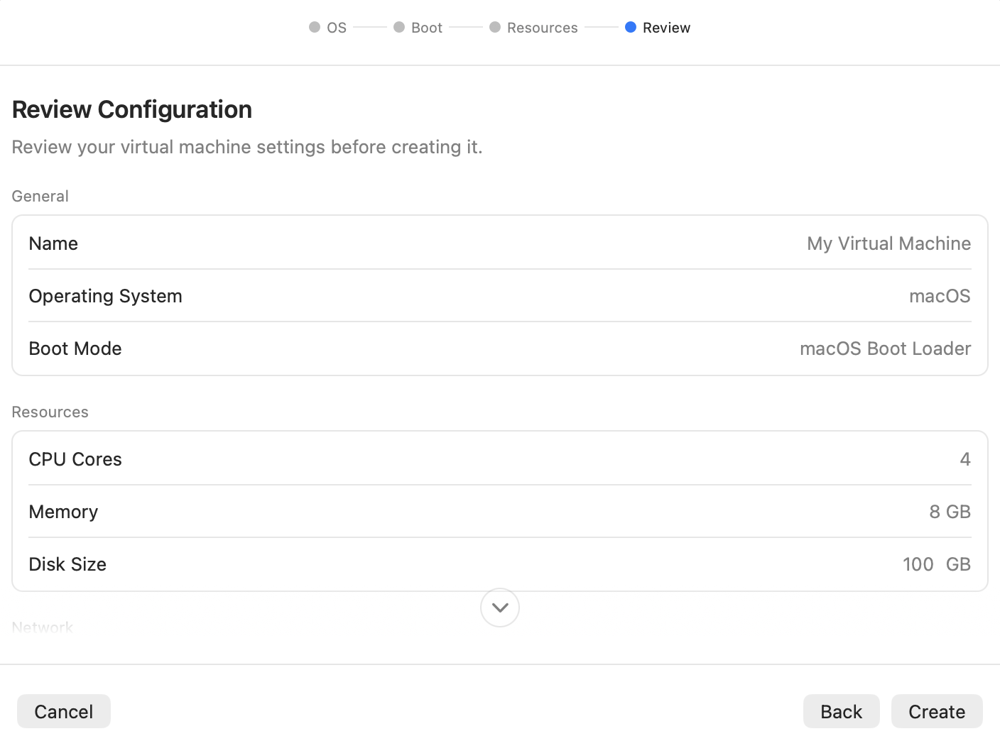
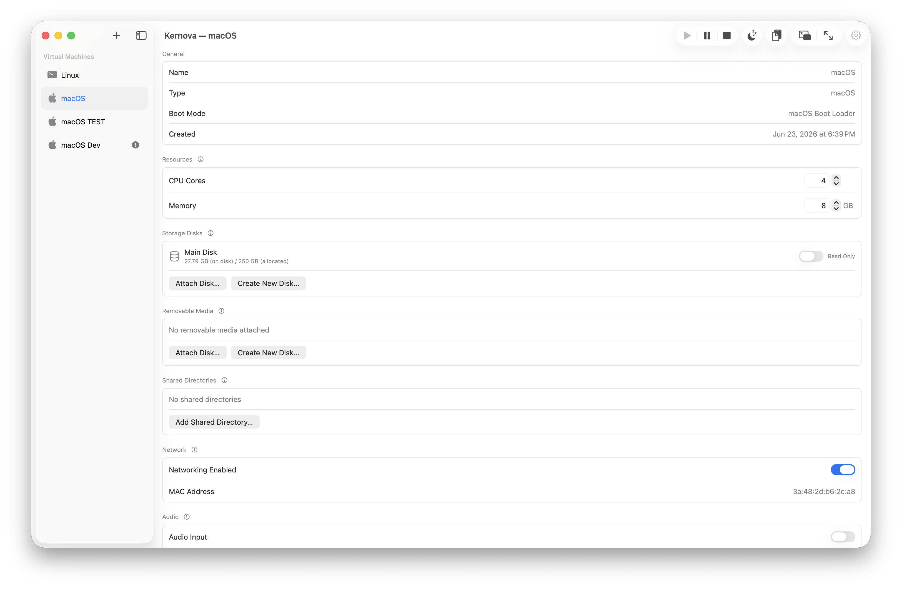
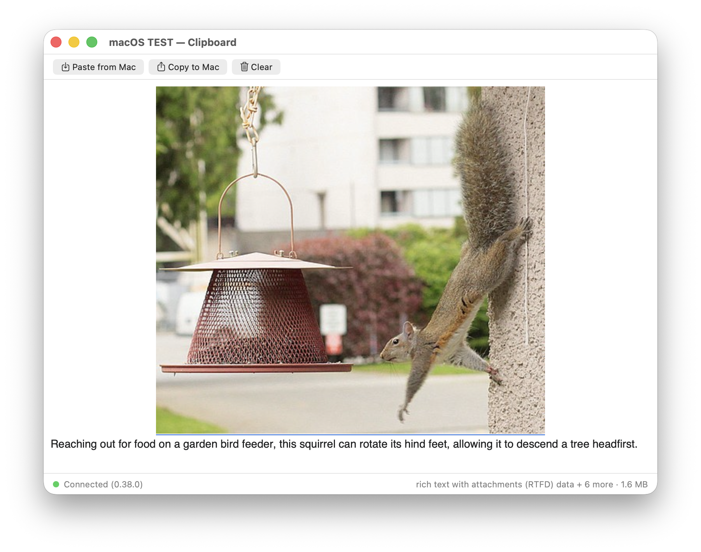

# Kernova

**Native virtual machines for Apple Silicon — macOS and Linux guests, built on Apple's [Virtualization.framework](https://developer.apple.com/documentation/virtualization).**


Kernova is a pure-AppKit Mac app for creating and running virtual machines directly on Apple Silicon — no third-party hypervisor, no kernel extensions, no licensing. It's for developers, QA engineers, and power users who want fast, disposable macOS and Linux VMs that feel like part of the Mac: a real source list of machines, one-click lifecycle, and deep host integration — shared clipboard, files, audio, and an in-guest agent — all inside the App Sandbox.

<p align="center">
  <picture>
    <source media="(prefers-color-scheme: dark)" srcset="docs/images/hero-dark.png">
    
  </picture>
</p>

## Features

### Virtual Machines

- **macOS & Linux guests** — Run macOS virtual machines and Linux VMs with EFI/UEFI or direct kernel boot
- **Full VM lifecycle** — Start, stop, pause, resume, suspend, and restore
- **Force Stop** — Terminate a hung running or paused VM immediately without saving state
- **Recovery mode** — One-shot "Start in Recovery Mode" for macOS guests
- **VM cloning** — Clone existing VMs with automatic naming and freshly regenerated identifiers
- **Bundle import** — Import VM bundles (`.kernova`) via double-click or drag-and-drop (also how you bring existing VMs into the sandboxed app's library — on the same volume the copy is an APFS clone, near-instant with no double disk usage)
- **Headless operation** — The app is a resident menu-bar app (with an opt-in "Open at Login" toggle), so closing the window keeps VMs running headless
- **Graceful shutdown** — Save-suspends running VMs automatically when the app itself terminates (menu-bar Quit, logout, or shutdown)
- **Sleep integration** — Auto-pauses running VMs on system sleep and resumes them on wake

### Guest Configuration

- **Creation wizard** — Step-by-step VM creation, including IPSW download for macOS guests
- **Linux boot modes** — EFI/UEFI boot or direct kernel boot with kernel, initrd, and command-line arguments
- **Shared directories** — Host-to-guest directory sharing via VirtioFS (read-only or read-write)
- **Display settings** — Configurable resolution and DPI (width, height, PPI)
- **Network** — MAC address management with persistent, stable addresses
- **Audio output** — Route guest audio to the host, on by default, toggleable per VM
- **Microphone passthrough** — Opt-in per VM (off by default for privacy); streams the host mic into the guest, with a permission-guidance popover when macOS mic access isn't granted

<p align="center">
  <picture>
    <source media="(prefers-color-scheme: dark)" srcset="docs/images/creation-wizard-dark.png">
    
  </picture>
</p>

### Storage & Media

- **ASIF disk images** — Apple Sparse Image Format for near-native SSD performance with space-efficient storage
- **Additional storage disks** — Attach or create extra ASIF disks beyond the primary disk, each with a read-only toggle, rename, Get Info, and drag-to-reorder boot order
- **Removable media (hot-plug)** — Attach and eject USB mass-storage devices (ISOs, disk images) at runtime without stopping the VM, with boot-priority support for installation media
- **Live disk-capacity display** — On-disk footprint vs. allocated capacity, read live for each disk

<p align="center">
  <picture>
    <source media="(prefers-color-scheme: dark)" srcset="docs/images/vm-settings-dark.png">
    
  </picture>
</p>

### Display & Console

- **Native UI** — Pure-AppKit app, Liquid Glass design language
- **Display modes** — Per-VM preference for where the display opens: inline in the detail pane, a pop-out window, or fullscreen (auto-hides the menu bar and Dock, and remembers the last fullscreen display)
- **Detail-pane settings toggle** — Flip the detail pane between the live display and the read-only settings form while the VM runs
- **Serial log** — Every VM's serial output is persisted to `serial.log` in its bundle
- **Serial socket relay** — Opt-in AF_UNIX socket exposing the serial port to external terminal tools (`socat`, `nc -U`), hot-toggleable while running

### Guest Integration

- **Guest agent (macOS guests)** — A lightweight in-guest menu-bar helper, installed from an attachable installer disk. It reports connection status and version back to the host over vsock, drives the in-app install/update prompt, and powers clipboard sync and log forwarding
- **Clipboard sync** — Bidirectional host↔guest clipboard sharing for text, rich text, images, and **multiple files and entire folders** (transparently archived and extracted) — chunk-streamed with **no size cap**, integrity-verified, and surfaced through a dedicated clipboard window with live transfer progress. Respects macOS privacy markers: concealed/password content shows a locked placeholder, and transient pasteboard snapshots aren't synced. macOS guests sync over the vsock agent; Linux guests sync clipboard text only (spice-vdagent)
- **Copy to Mac** — Lazy guest→host file transfer backed by a host File Provider, so pasted files materialize on the host on demand
- **Large-file paste** — A guest File Provider transport materializes large host files inside the guest on demand
- **Guest log forwarding (macOS guests)** — Opt-in per VM; the guest's `os.Logger` records surface on the host in Console.app (subsystem `app.kernova.guest`). Live-toggleable while the VM runs

<p align="center">
  <picture>
    <source media="(prefers-color-scheme: dark)" srcset="docs/images/clipboard-dark.png">
    
  </picture>
</p>

### Management

- **VM renaming** — Inline rename or via menu
- **Sidebar reordering** — Drag VMs into a custom, persisted order
- **Customizable toolbar** — Standard AppKit toolbar customization, with the layout remembered
- **App preferences** — A Settings window (⌘,) with an Advanced tab (e.g. always-show-advanced-actions)
- **Directory watching** — Monitors the VMs directory for external filesystem changes and reconciles the library
- **Safe deletion** — A unified sheet to move a VM to the Trash or delete it immediately, surfacing any external attachments to optionally trash alongside it

## Requirements

- macOS 26 (Tahoe) or later
- Apple Silicon
- Xcode 26 or later
- Swift 6

## Development setup

After cloning, run:

```bash
make install-hooks
make bootstrap
```

`install-hooks` points the repo at the checked-in `.githooks/` directory. It's a one-time setup per clone (Git does not auto-activate checked-in hooks) and enables two hooks: a pre-push hook that runs `make lint` locally, matching the required `lint` check enforced on `main` (bypass an individual push with `git push --no-verify`), and a post-checkout hook that sets up new git worktrees — it copies the gitignored local files listed in [`.worktreeinclude`](.worktreeinclude) from the main checkout (the same list Claude Code and other worktree tools consume when *they* create a worktree, so `git worktree add` honors it too), then re-runs `bootstrap` (below) if `Config/Local.xcconfig` is still missing — so a new git worktree builds in Xcode immediately with no manual step.

`bootstrap` derives your own signing team from your Apple Development (or Developer ID) certificate into a gitignored `Config/Local.xcconfig`, so a Debug build signs as *you* rather than a hardcoded team — see [Signing: Debug vs Release](#signing-debug-vs-release) below. `make build` and `make test` run it automatically, and the post-checkout hook covers additional git worktrees (each needs its own `Config/Local.xcconfig`, since gitignored files aren't shared between worktrees; the hook copies the main checkout's file, falling back to fresh derivation), so this is only a manual step if you're building a fresh clone straight from Xcode without ever running a `make` target first.

Run `make doctor` to confirm your local toolchain (macOS, Xcode, Swift, swift-format), signing team, and git hooks match what Kernova needs before building.

Run `make` with no arguments to see all build, test, format, and lint targets.

## Building

1. Open `Kernova.xcodeproj` in Xcode 26
2. Select the `Kernova` scheme
3. Build and run (Cmd+R)

The app requires the `com.apple.security.virtualization` entitlement, which is included in the project configuration. If you haven't run `make bootstrap` yet (see above), do that first — Xcode's own ⌘R doesn't run it for you.

### Signing: Debug vs Release

Kernova signs differently per build configuration, driven by the `KERNOVA_APP_GROUP` build setting that scopes the clipboard File Provider's shared container:

- **Debug** uses a Team-ID-prefixed app group (`$(DEVELOPMENT_TEAM).app.kernova`). macOS grants a Team-ID-prefixed group silent container access with **no provisioning profile**, so a Debug build (⌘R, `make build`, `make test`) works with *any* signing team. `DEVELOPMENT_TEAM` is not hardcoded: `make bootstrap` ([`Tools/bootstrap-team.sh`](Tools/bootstrap-team.sh)) derives it from your own signing certificate into a gitignored `Config/Local.xcconfig`, included by the tracked `Config/Base.xcconfig` ([#476](https://github.com/nicholas-lonsinger/kernova/issues/476)). No Apple Developer Program membership or developer-portal setup is needed to build and run, and the guest agent never shows the "access data from other apps" consent prompt in a VM.
- **Release** uses the canonical `group.app.kernova`. That form is **not** silently authorized: it requires the app group registered on the Apple Developer portal plus an embedded provisioning profile, which in turn requires a paid **Apple Developer Program** membership and a distribution identity — **Developer ID** for direct distribution, or Apple Distribution for the Mac App Store. A Release build fails to sign without them.

Day-to-day development only needs Debug. The Release path matters when cutting a distributable build; see [docs/SANDBOX.md](docs/SANDBOX.md) for the full rationale.

## Testing

The project has comprehensive test coverage using [Swift Testing](https://developer.apple.com/documentation/testing/) (`@Test`, `#expect`). All services use protocol-based dependency injection with mock implementations for full testability.

```bash
make test
```

This runs all three test targets via the test plan; it wraps the canonical `xcodebuild` invocation documented in [AGENTS.md](AGENTS.md). See the test coverage section in [docs/ARCHITECTURE.md](docs/ARCHITECTURE.md) for details.

## Architecture

See [docs/ARCHITECTURE.md](docs/ARCHITECTURE.md) for detailed component descriptions, data flow diagrams, and design decisions — and [docs/README.md](docs/README.md) for the full documentation index. Design philosophy and UI guidelines live in [docs/SPEC.md](docs/SPEC.md); the clipboard subsystem is documented in [docs/CLIPBOARD.md](docs/CLIPBOARD.md).

```
Kernova/
├── App/          # AppDelegate, MainWindowController
├── Models/       # VMConfiguration, VMInstance, enums
├── Services/     # VM lifecycle, storage, disk images, IPSW, installation
├── Views/        # AppKit view controllers (sidebar, detail, console, creation wizard)
├── ViewModels/   # Observable view models
└── Utilities/    # Formatters, extensions
```

Alongside the app target, the repo contains the in-guest menu-bar agent (`KernovaMacOSAgent/`), the shared SwiftPM package (`KernovaKit/`), the guest and host clipboard File Provider extensions (`KernovaMacOSAgentFileProvider/`, `KernovaFileProvider/`), and the relaunch helper (`KernovaRelaunchHelper/`) — see [docs/ARCHITECTURE.md](docs/ARCHITECTURE.md) for the full map.

### Key Components

- **VMConfiguration** — Codable model persisted as `config.json` in each VM bundle
- **VMInstance** — Runtime wrapper combining config, VZVirtualMachine, and status
- **ConfigurationBuilder** — Translates VMConfiguration into VZVirtualMachineConfiguration
- **VirtualizationService** — VM lifecycle management (start/stop/pause/save/restore)
- **VMStorageService** — VM bundle CRUD at `~/Library/Application Support/Kernova/VMs/`
- **VMLifecycleCoordinator** — Orchestrates multi-step VM operations with per-VM serialization
- **VMDirectoryWatcher** — Monitors the VMs directory for external filesystem changes
- **SystemSleepWatcher** — Pauses running VMs on system sleep and resumes on wake

### VM Bundle Structure

Each VM is stored as a directory under `~/Library/Application Support/Kernova/VMs/<UUID>/`:

```
<UUID>/
  config.json           # Serialized VMConfiguration
  Disk.asif             # ASIF sparse disk image
  AuxiliaryStorage      # macOS auxiliary storage
  HardwareModel         # VZMacHardwareModel data
  MachineIdentifier     # VZMacMachineIdentifier data
  SaveFile.vzvmsave     # Saved VM state (suspend/resume)
  serial.log            # Persisted serial console output
```

## License

Kernova is **source-available** under the [Functional Source License (FSL-1.1-ALv2)](LICENSE): you're free to use, modify, and redistribute it for any purpose **except** offering a competing commercial product or service. Internal use, non-commercial education, and non-commercial research are explicitly permitted. Each release converts to Apache 2.0 two years after its publication. See [LICENSE](LICENSE) for the full terms.
