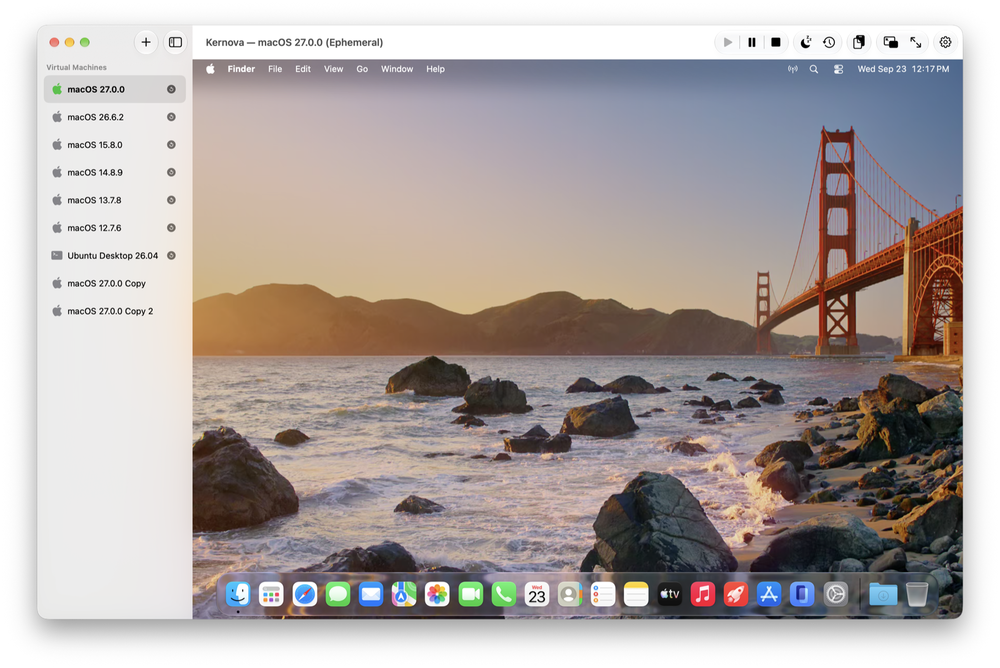
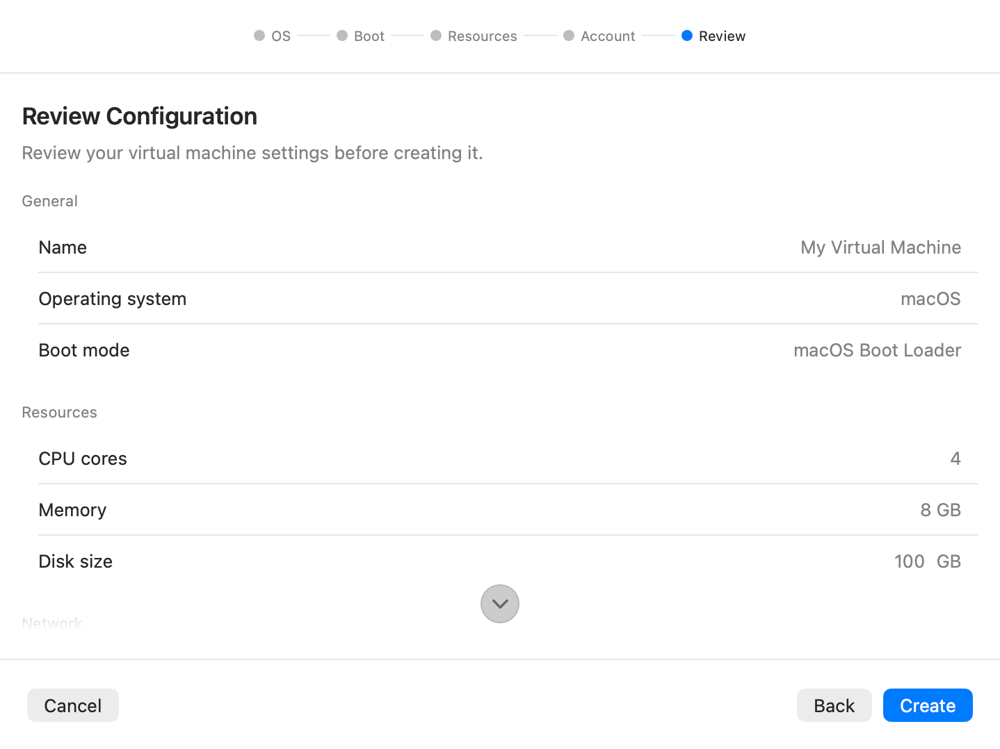
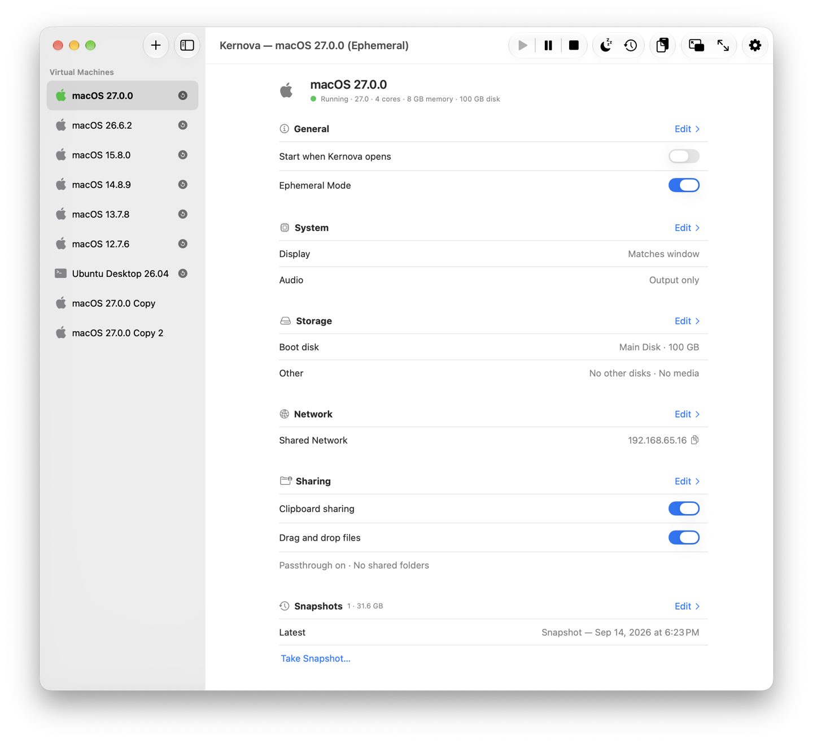
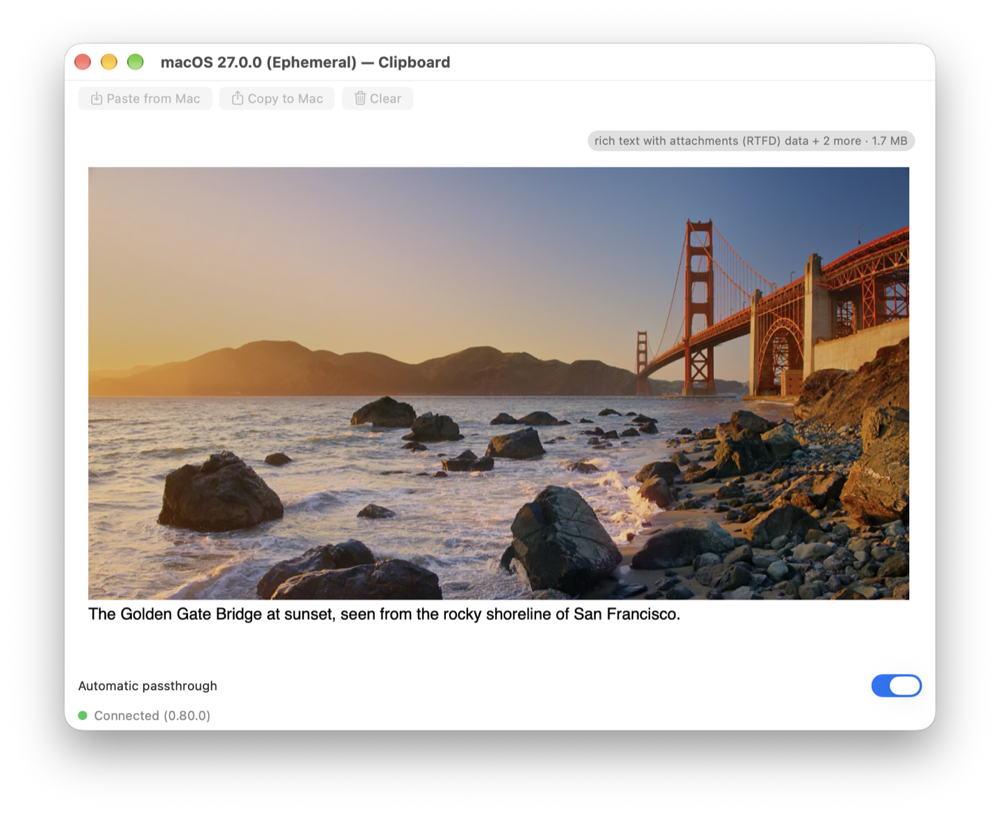

# Kernova

**Native virtual machines for Apple Silicon — macOS and Linux guests, built on Apple's [Virtualization.framework](https://developer.apple.com/documentation/virtualization).**


Kernova is a pure-AppKit Mac app for creating and running virtual machines directly on Apple Silicon — no third-party hypervisor, no kernel extensions, no licensing. It's for developers, QA engineers, and power users who want fast, disposable macOS and Linux VMs that feel like part of the Mac: a real source list of machines, one-click lifecycle, and deep host integration — shared clipboard, files, audio, and an in-guest agent — all inside the App Sandbox.

Requires macOS 26 (Tahoe) or later on Apple Silicon to run the app. macOS guests are supported back to 12.0.1 (Monterey), including the in-guest agent.

<p align="center">
  <picture>
    <source media="(prefers-color-scheme: dark)" srcset="docs/images/hero-dark.png">
    
  </picture>
</p>

## Features

### Virtual machines

- **macOS and Linux guests** — a step-by-step creation wizard: macOS installs from the latest IPSW, a version catalog, a pasted URL, or a local file; Linux installs from a downloadable distribution catalog (checksum-verified against the distribution's own manifest), an image URL, or a local ISO, booting EFI/UEFI or a direct kernel
- **Full lifecycle** — start, stop, pause, resume, suspend, and restore, plus Force Stop for a hung VM and a one-shot Start in Recovery Mode for macOS guests
- **Snapshots** — named restore points, taken while a VM is running, suspended, or stopped: the first two keep the guest's memory alongside its disks and settings, the last keeps the disks and settings alone. Reverting is repeatable, where restoring a suspended VM consumes its saved state, and it leaves disks attached from outside the bundle as they are.
  The copies share blocks with the VM's own disks, so taking one is near-instant and adds little to what's on disk
- **Ephemeral mode** — a per-VM switch that returns the guest to a chosen baseline snapshot at every shutdown, discarding whatever the session changed inside it. Suspending keeps the session — including the save-suspend when Kernova quits — and it reverts at the next shutdown instead; a sidebar badge and a marker on the running VM keep a throwaway session visible as one
- **Cloning and import** — clone a VM with a fresh machine identity, or keep it via a setting or the ⌥-alternate menu command; import `.kernova` bundles by double-click or drag-and-drop, which is also how you bring existing VMs into the sandboxed library (on the same volume it's an APFS clone: near-instant, no double disk usage)
- **Background operation** — a resident menu-bar app, on by default and toggleable in Settings, with opt-in Open at Login, so closing the window can leave VMs running headless. Quitting save-suspends them; system sleep auto-pauses and wake resumes
- **Automatic startup** — a per-VM opt-in that boots (or resumes from saved state) that guest whenever Kernova opens; paired with Open at Login, the machine comes up with those VMs already running

<p align="center">
  <picture>
    <source media="(prefers-color-scheme: dark)" srcset="docs/images/creation-wizard-dark.png">
    
  </picture>
</p>

### Virtual hardware

- **Storage** — ASIF sparse disks for near-native SSD performance, with live on-disk-vs-allocated capacity, extra disks with per-disk read-only and drag-to-reorder boot order, and hot-plug removable media (ISOs, disk images) attachable and ejectable while the VM runs
- **Shared directories** — host folders exposed over VirtioFS, read-only or read-write
- **Display** — resolution presets or a custom size, HiDPI, and live auto-resize with the window; per-VM choice of inline, pop-out window, or fullscreen, and a toggle between the live display and a read-only settings form while the VM runs
- **Input** — Mac or USB keyboard-and-pointer devices, chosen automatically by guest macOS version with a per-VM override
- **Audio** — guest audio routed to the host, on by default; host microphone passthrough opt-in per VM, off by default for privacy
- **Network** — per-VM modes: Shared Network (default; private outbound through the host, with port-forwarding rules), Bridged onto a chosen host interface or Automatic, Host Only (guests reach the host and each other, nothing wider), or None — plus a live IP address readout and a persistent, editable MAC address with one-click regeneration
- **Serial** — output persisted to a size-capped `serial.log` in the bundle, plus an opt-in AF_UNIX socket relay for external tools (`socat`, `nc -U`), hot-toggleable while running

<p align="center">
  <picture>
    <source media="(prefers-color-scheme: dark)" srcset="docs/images/vm-settings-dark.png">
    
  </picture>
</p>

### Guest integration

- **Guest agent (macOS guests)** — a lightweight in-guest menu-bar helper, installed from an attachable installer disk, reporting status and version to the host over vsock
- **Clipboard sync** — bidirectional host↔guest text, rich text, images, and multiple files or entire folders. Copying is instant in either direction: only a paste moves bytes — up to an adjustable ceiling (2 GB by default) — with integrity verification and live transfer progress in a dedicated clipboard window.
  Per-VM opt-in Automatic Clipboard Passthrough syncs continuously with no paste step. Concealed and password content shows a locked placeholder; transient pasteboard content isn't synced. macOS guests sync over the vsock agent, Linux guests sync text only via spice-vdagent
- **Drag and drop (macOS guests)** — files dragged from the Finder onto a running guest's display land in its Downloads folder and are revealed there, keeping both copies rather than overwriting a name already taken, with live transfer progress on the way. On per VM by default; a display whose agent isn't connected refuses the drag rather than taking files it can't deliver
- **Log forwarding (macOS guests)** — opt-in per VM and live-toggleable; the guest's `os.Logger` records surface on the host in Console.app under the `app.kernova.guest` subsystem

<p align="center">
  <picture>
    <source media="(prefers-color-scheme: dark)" srcset="docs/images/clipboard-dark.png">
    
  </picture>
</p>

### The app itself

Pure AppKit in the Liquid Glass design language: a source-list sidebar with drag reordering and inline rename, a customizable toolbar, a Settings window (⌘,), and a deletion sheet that offers to trash a VM's external attachments alongside it.

VMs are also drivable without the window: App Intents put start, stop, pause, resume, suspend, restart, open, and snapshot capture in Siri, the Shortcuts app, and Spotlight, with each VM as a typed entity you pick or name out loud.

## Development setup

Everything below is for building and working on Kernova itself. You'll need Xcode 26 and Swift 6 on top of the requirements above.

After cloning:

```bash
make setup   # one-time per clone; rerun any time
```

Every step is idempotent, so rerunning `setup` after the environment drifts is safe. What it does:

- **Git hooks** — points the repo at the checked-in `.githooks/`, which Git does not activate on its own: a pre-push `make lint` and `make test-tools` matching the required `lint` check on `main` (bypass a single push with `git push --no-verify`), and a post-checkout hook that sets up a new git worktree with no manual step. The hook machinery is documented in [docs/BUILD.md](docs/BUILD.md).
- **Homebrew tools** — `shellcheck`, `gh`, `protoc`, and `xcode-build-server`, skipping any already installed. Without [Homebrew](https://brew.sh) the run names what it skipped and carries on; none of them is needed to build or test.
- **`buildServer.json`** — this checkout's copy, which gives editors and Claude Code's Swift language server the project's real compiler flags. Build the checkout once for the flags to resolve.
- **Periphery** — the pinned release `make dead-code` scans with.

It ends with `make doctor`, which checks that your toolchain, signing, and hooks match what Kernova needs.

Then open `Kernova.xcodeproj`, select the `Kernova` scheme, and build and run (⌘R). The app requires the `com.apple.security.virtualization` entitlement, already in the project configuration. Bridged and Host Only networking additionally need the restricted `com.apple.vm.networking` entitlement; a build signed without a provisioning profile omits those modes from the network picker and everything else still works.

`make` with no arguments lists every build, test, format, and lint target.

**Debug needs no signing team or Apple account** — it signs ad-hoc ("Sign to Run Locally") by default, so a fresh clone builds and runs as-is. With a development certificate, point Debug at it through a gitignored `Config/Local.xcconfig` off `Config/Local.xcconfig.example` so macOS privacy grants survive a rebuild ([docs/BUILD.md](docs/BUILD.md#signing-identity)). **Release** requires a paid membership and a distribution identity (Developer ID, or Apple Distribution for the Mac App Store); it matters only when cutting a distributable build ([docs/RELEASING.md](docs/RELEASING.md)).

## Testing

```bash
make test
```

Runs every test target via the test plan. Tests use [Swift Testing](https://developer.apple.com/documentation/testing/) against protocol-based mocks; the conventions are in [docs/TESTING.md](docs/TESTING.md).

## Architecture

[docs/ARCHITECTURE.md](docs/ARCHITECTURE.md) has the component map, data flow, and design decisions; [docs/README.md](docs/README.md) indexes the rest, including [docs/DESIGN.md](docs/DESIGN.md) for design philosophy and UI guidelines, [docs/CLIPBOARD.md](docs/CLIPBOARD.md) for the clipboard subsystem, and [docs/NETWORKING.md](docs/NETWORKING.md) for networking principles.

## License

Kernova is **source-available** under the [Functional Source License (FSL-1.1-ALv2)](LICENSE): you're free to use, modify, and redistribute it for any purpose **except** offering a competing commercial product or service. Internal use, non-commercial education, and non-commercial research are explicitly permitted. Each release converts to Apache 2.0 two years after its publication. See [LICENSE](LICENSE) for the full terms.
