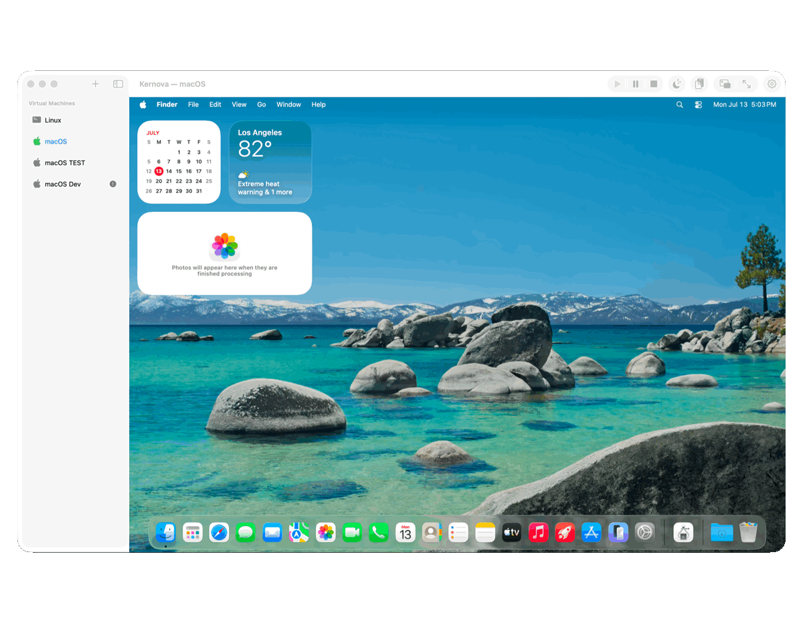

# Kernova

**Native virtual machines for Apple Silicon — macOS and Linux guests, built on Apple's [Virtualization.framework](https://developer.apple.com/documentation/virtualization).**

[](https://github.com/nicholas-lonsinger/kernova/actions/workflows/xcodebuild-test.yml)
[](https://github.com/nicholas-lonsinger/kernova/actions/workflows/lint.yml)


[](LICENSE)

[Features](#features) · [Automation](#automation) · [Requirements](#requirements) · [Building](#building-kernova) · [Documentation](#documentation) · [License](#license)

Kernova is a pure-AppKit Mac app for creating and running virtual machines directly on Apple Silicon — no third-party hypervisor, no kernel extensions, no licensing. It's for developers, QA engineers, and power users who want fast, disposable macOS and Linux VMs that feel like part of the Mac: a real source list of machines, one-click lifecycle, and deep host integration — shared clipboard, files, audio, and an in-guest agent — all inside the App Sandbox.

<p align="center">
  <picture>
    <source media="(prefers-color-scheme: dark)" srcset="docs/images/hero-dark.png">
    
  </picture>
</p>

<details>
<summary><b>▶ Take the 15-second tour</b> — the main window, creation wizard, VM settings, and clipboard window in turn</summary>
<p align="center">
  <picture>
    <source media="(prefers-color-scheme: dark)" srcset="docs/images/tour-dark.gif">
    
  </picture>
</p>
</details>

## Requirements

| | |
|---|---|
| **Host** | macOS 26 (Tahoe) or later on Apple Silicon |
| **macOS guests** | macOS 12.0.1 (Monterey) and later, including the in-guest agent |
| **Linux guests** | ARM64 distributions — Ubuntu, Debian, Fedora, and Kali from the built-in catalog, or any image of your own |

## Features

### Virtual machines

- **macOS and Linux guests** — a step-by-step creation wizard. macOS installs from the latest IPSW, a version catalog, a pasted URL, or a local file. Linux installs from a downloadable distribution catalog (checksum-verified against the distribution's own manifest), an image URL, or a local ISO, booting EFI/UEFI or a direct kernel.
- **Full lifecycle** — start, stop, pause, resume, suspend, and restore, plus Force Stop for a hung VM and a one-shot Start in Recovery Mode for macOS guests.
- **Snapshots** — named restore points with notes, taken while a VM is running, suspended, or stopped. The first two keep the guest's memory alongside its disks and settings; the last keeps the disks and settings alone. Reverting is repeatable, and leaves disks attached from outside the bundle as they are. Snapshot copies share blocks with the VM's own disks, so taking one is near-instant and adds little on disk.
- **Ephemeral mode** — a per-VM switch that returns the guest to a chosen baseline snapshot at every shutdown, discarding whatever the session changed. Suspending keeps the session — including the save-suspend when Kernova quits — and it reverts at the next shutdown instead. A sidebar badge and a marker on the running VM keep a throwaway session visible as one.
- **Cloning and import** — clone a VM with a fresh machine identity, or keep it via a setting or the ⌥-alternate menu command. Import `.kernova` bundles by double-click or drag-and-drop, which is also how you bring existing VMs into the sandboxed library; on the same volume it's an APFS clone, near-instant with no double disk usage.
- **Background operation** — a resident status-bar item, on by default and toggleable in Settings, with opt-in Open at Login, so closing the window can leave VMs running headless. Its menu lists every running VM with its status, surfaces any start failure, and shows clipboard-transfer progress right in the icon. Quitting save-suspends running VMs; system sleep auto-pauses them and wake resumes.
- **Automatic startup** — a per-VM opt-in that boots (or resumes from saved state) that guest whenever Kernova opens. Paired with Open at Login, the Mac comes up with those VMs already running.

<p align="center">
  <picture>
    <source media="(prefers-color-scheme: dark)" srcset="docs/images/creation-wizard-dark.png">
    
  </picture>
</p>

### Virtual hardware

- **Storage** — ASIF sparse disks for near-native SSD performance, with live on-disk-vs-allocated capacity, extra disks with per-disk read-only and drag-to-reorder boot order, and hot-plug removable media (ISOs, disk images) attachable and ejectable while the VM runs.
- **Shared directories** — host folders exposed over VirtioFS, read-only or read-write.
- **Display** — resolution presets or a custom size, HiDPI, sizing to fit the window at startup, and live auto-resize as the window changes. Per-VM choice of inline, pop-out window, or fullscreen, and a toggle between the live display and a read-only settings form while the VM runs.
- **Input** — Mac or USB keyboard-and-pointer devices, chosen automatically by guest macOS version with a per-VM override. Each VM also chooses when system hot keys reach the guest instead of the Mac: never, only in full screen, or always — switchable while the VM runs.
- **Audio** — guest audio routed to the host, on by default; host microphone passthrough opt-in per VM, off by default for privacy.
- **Network** — per-VM modes: Shared Network (default; private outbound through the host, with TCP and UDP port-forwarding rules), Bridged onto a chosen host interface or Automatic, Host Only (guests reach the host and each other, nothing wider), or None. A live IP address readout, and a persistent, editable MAC address with one-click regeneration and a warning when two VMs share one.
- **Serial** — output persisted to a size-capped `serial.log` in the bundle, plus an opt-in AF_UNIX socket relay for external tools (`socat`, `nc -U`), hot-toggleable while running.

<p align="center">
  <picture>
    <source media="(prefers-color-scheme: dark)" srcset="docs/images/vm-settings-dark.png">
    
  </picture>
</p>

### Guest integration

- **Guest agent (macOS guests)** — a lightweight in-guest helper, installed from an attachable installer disk, that reports status and version to the host over vsock. It has its own status-bar menu inside the guest showing the host connection, what's being shared, and when the host bundles a newer agent than the one installed.
- **Clipboard sync** — bidirectional host↔guest text, rich text, images, and multiple files or entire folders. Copying is instant in either direction; only a paste moves bytes — up to an adjustable ceiling (2 GB by default) — with integrity verification and live transfer progress in a dedicated clipboard window.
  Per-VM opt-in Automatic Clipboard Passthrough syncs continuously with no paste step. Concealed and password content shows a locked placeholder, and transient pasteboard content isn't synced. macOS guests sync over the vsock agent; Linux guests sync text only, via spice-vdagent.
- **Drag and drop (macOS guests)** — files dragged from the Finder onto a running guest's display land in its Downloads folder and are revealed there, keeping both copies rather than overwriting a name already taken, with live transfer progress on the way. On per VM by default; a display whose agent isn't connected refuses the drag rather than taking files it can't deliver.
- **Log forwarding (macOS guests)** — opt-in per VM and live-toggleable; the guest's `os.Logger` records surface on the host in Console.app under the `app.kernova.guest` subsystem.

<p align="center">
  <picture>
    <source media="(prefers-color-scheme: dark)" srcset="docs/images/clipboard-dark.png">
    
  </picture>
</p>

### The app itself

Pure AppKit in the Liquid Glass design language: a source-list sidebar with drag reordering and inline rename, a customizable toolbar, and a deletion sheet that offers to trash a VM's external attachments alongside it.

The Settings window (⌘,) has four panes:

| Pane | What it holds |
|---|---|
| **General** | Open at Login, and whether Kernova keeps running in the status bar after its last window closes |
| **Clipboard** | The maximum paste size for host↔guest transfers |
| **Reminders** | The status-bar quit reminder and the guest-agent install nudge, app-wide and per VM, with a reset |
| **Advanced** | Always show ⌥-gated commands, refuse to boot two VMs sharing a machine ID, whether clones get a new machine ID, and the `kernova` command-line tool and shell-completion installers |

## Automation

Every VM is drivable without the window, from three surfaces that share one library and one set of verbs.

**Shortcuts and Spotlight.** App Intents cover the lifecycle (start, stop, pause, resume, suspend, restart, open, reveal), the library (search, import, clone, rename, delete), snapshots (take, find, revert, rename, edit notes, delete), and reading a VM's state or IP address — with each VM as a typed entity you pick or search by name.

**AppleScript.** A scripting dictionary puts the lifecycle verbs and every VM property in Script Editor and Automator. **File → Open Dictionary…** in Script Editor lists everything; a few idioms the dictionary alone doesn't show:

```applescript
tell application "Kernova"
    -- A name matches without regard to case; a `whose` test filters the library.
    get name of every virtual machine whose state is running

    -- `IP address` is `missing value` until the guest has one.
    start virtual machine "Alpha"
    repeat until IP address of virtual machine "Alpha" is not missing value
        delay 1
    end repeat

    -- A stop that discards guest state refuses without `with confirmation`.
    -- AppleScript gives up on a reply after two minutes unless told otherwise.
    with timeout of 600 seconds
        stop virtual machine "Alpha" by force with confirmation
    end timeout
end tell
```

**The `kernova` command-line tool.** Bundled inside the app at `Contents/Helpers/kernova`; **Settings → Advanced → Install…** links it into a folder you choose, so a shell always reaches the copy the installed app ships. Beyond the lifecycle, it reads and writes VM settings, manages snapshots, shared directories, and port-forwarding rules, and blocks until a VM reaches a state:

```bash
kernova list
kernova start Alpha
kernova wait Alpha --until agent
kernova ip Alpha --wait
kernova snapshot take Alpha --name "before upgrade"
kernova get Alpha memory
kernova share add Alpha ~/Projects --read-only
kernova forward add Alpha 2222:22
kernova stop Alpha --format json
```

A verb starts Kernova hidden when it isn't running; `--no-launch` refuses instead, and `--format json` makes every verb's output machine-readable. The same Settings pane installs shell completions for zsh, bash, and fish, which offer your own virtual machines, their snapshots, and the setting keys as candidates. `kernova --help` is the reference — every verb and flag, and the exit codes a script branches on.

## Building Kernova

Kernova is built from source with Xcode 26 and Swift 6 on a Mac meeting the [requirements](#requirements). After cloning:

```bash
make setup   # one-time per clone; rerun any time
```

Every step is idempotent, so rerunning `setup` after the environment drifts is safe. What it does:

- **Git hooks** — points the repo at the checked-in `.githooks/`, which Git does not activate on its own: a pre-push `make lint` matching the required `lint` check on `main` (bypass a single push with `git push --no-verify`), and a post-checkout hook that sets up a new git worktree with no manual step. The hook machinery is documented in [docs/BUILD.md](docs/BUILD.md).
- **Homebrew tools** — `shellcheck`, `gh`, `protoc`, and `xcode-build-server`, skipping any already installed. Without [Homebrew](https://brew.sh) the run names what it skipped and carries on; none of them is needed to build or test.
- **`buildServer.json`** — this checkout's copy, which gives editors and Claude Code's Swift language server the project's real compiler flags. Build the checkout once for the flags to resolve.
- **Periphery** — the pinned release `make dead-code` scans with.

It ends with `make doctor`, which checks that your toolchain, signing, and hooks match what Kernova needs.

Then open `Kernova.xcodeproj`, select the `Kernova` scheme, and build and run (⌘R). `make` with no arguments lists every build, test, format, and lint target.

**Debug needs no signing team or Apple account** — it signs ad-hoc ("Sign to Run Locally") by default, so a fresh clone builds and runs as-is. With a development certificate, point Debug at it through a gitignored `Config/Local.xcconfig` off `Config/Local.xcconfig.example` so macOS privacy grants survive a rebuild ([docs/BUILD.md](docs/BUILD.md#signing-identity)). **Release** requires a paid membership and a distribution identity (Developer ID, or Apple Distribution for the Mac App Store); it matters only when cutting a distributable build ([docs/RELEASING.md](docs/RELEASING.md)).

The app requires the `com.apple.security.virtualization` entitlement, already in the project configuration. Bridged and Host Only networking additionally need the restricted `com.apple.vm.networking` entitlement; a build signed without a provisioning profile omits those modes from the network picker and everything else still works.

### Testing

```bash
make test
```

Runs every test target via the test plan. Tests use [Swift Testing](https://developer.apple.com/documentation/testing/) against protocol-based mocks; the conventions are in [docs/TESTING.md](docs/TESTING.md).

## Documentation

[docs/ARCHITECTURE.md](docs/ARCHITECTURE.md) has the component map, data flow, and design decisions. [docs/README.md](docs/README.md) indexes the rest — including [DESIGN.md](docs/DESIGN.md) for design philosophy and UI guidelines, [CLIPBOARD.md](docs/CLIPBOARD.md) for the clipboard subsystem, [NETWORKING.md](docs/NETWORKING.md) for networking principles, and [VERSION-FLOORS.md](docs/VERSION-FLOORS.md) for which guest versions support what.

## Contributing and security

Bug reports and feedback are welcome as [issues](https://github.com/nicholas-lonsinger/kernova/issues). Outside code contributions aren't being accepted yet — [CONTRIBUTING.md](CONTRIBUTING.md) explains why. Report vulnerabilities privately through [GitHub's advisory form](https://github.com/nicholas-lonsinger/kernova/security/advisories/new); [SECURITY.md](SECURITY.md) describes what's in scope.

## License

Kernova is **source-available** under the [Functional Source License (FSL-1.1-ALv2)](LICENSE): you're free to use, modify, and redistribute it for any purpose **except** offering a competing commercial product or service. Internal use, non-commercial education, and non-commercial research are explicitly permitted. Each release converts to Apache 2.0 two years after its publication. See [LICENSE](LICENSE) for the full terms.
